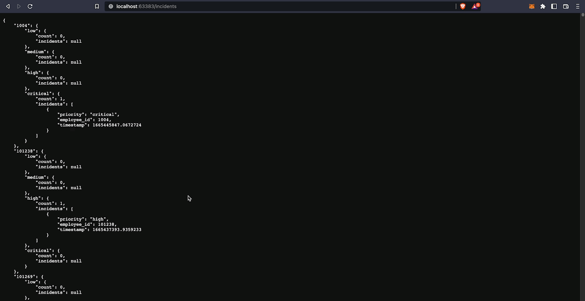

# README

### Purpose
This repo is an assignment.
[Assignment instructions](https://gist.github.com/vishalbollu/f6e3bd98c234dc369c45e50984fc5706)  
According to instructions only one http endpoint was implemented: `/incidents`  

  

#### Local development
In order to run, app needs following secrets that are not present in this repo.  
./config/secrets/auth_username  
./config/secrets/auth_password  

`go run main.go` Start API server
#### Building
`GOOS=linux GOARCH=amd64 go build -o /app/elevate-sec main.go`

#### Deploying
`kubernetes apply -f ./kubernetes/manifests.yaml`  
`kubernetes apply -f ./kubernetes/secrets-template.yaml` add required values.  

### How I would enhance this code if you needed it to run in production.
- I would make a helm chart to have a single manifest template for different environments.  
- I would add CI pipeline that triggers on every push or on a tagged push.
    - Add build status to the repo
    - [Add auto-generated CHANGELOG ](https://github.com/conventional-changelog/standard-version)
    - Add version [auto-increment based on commit messages](https://pkg.go.dev/github.com/pantheon-systems/autotag)
- I would add ArgoCD App manifest.  
- Add [external-secrets](https://github.com/external-secrets/external-secrets) operator for secrets handling.  
- I would expose app's metrics to Prometheus [this](https://pkg.go.dev/github.com/prometheus/client_golang/prometheus).  
- Add Network Policy to restrict unintended traffc.
- Add build information to the docker image (version).  
- Add **go tests**
- Catch all possible errors in a more efficient way.
- Refactor merge function in `main.go`. Lines 118-123 hint at some inefficiency. 
- Add license type to the repo
- Add PDP manifest
- Add taints to run only on private subnets nodes.  
- Store image in a private docker repo.  
- Enhance readme:
    - Add dependencies: For instance: this app depends on **incident-api.use1stag.elevatesecurity.io/incidents** api.  
    - Specify development style (CI/Trunk-based, GitHub flow, GitFlow, SemVer flow )  
    - API documentation
    - Repo status (WiP, Abandoned, Ready)
- Add github integration to alert in case of accidentally exposed secrets. 

